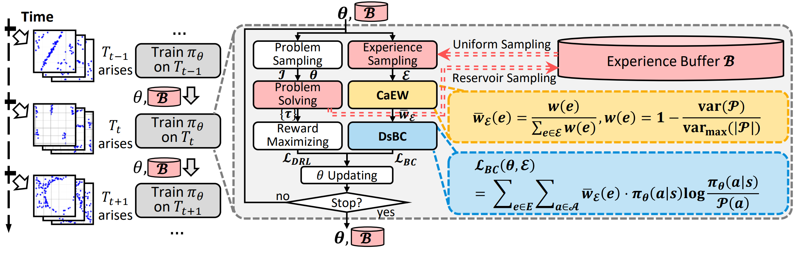

# LiBOG

[](https://arxiv.org/abs/2509.21765)

Implementation of paper **"Lifelong Learning with Behavior Consolidation for Vehicle Routing"**. 




## Citing

Lifelong Learning with Behavior Consolidation for Vehicle Routing, Jiyuan Pei, Yi Mei, Jialin Liu, Mengjie Zhang and Xin Yao. arXiv:2509.21765.

## Repository Structure

```
├── LICENSE
├── LLR-BC.png
├── README.md                           # This file
├── requirements.txt                     # Python dependencies
├── CVRP/                               # Capacitated Vehicle Routing Problem resources
│   ├── CVRProblemDef.py
│   ├── cvrplib-Set-X/                  # CVRPLIB benchmark instances
│   ├── generated_test_instances/
│   └── LLRBC-POMO/                     # CVRP-specific model, training and testing
│       ├── compare_paper.py
│       ├── CVRPEnv.py
│       ├── CVRPlibEnv.py
│       ├── CVRPlibTester.py
│       ├── cvrplib_test.py
│       ├── CVRPModel.py
│       ├── CVRPTester.py
│       ├── CVRPTrainer.py
│       ├── generate_instances.py
│       ├── init_model.pt
│       ├── test_all_saved_model.py
│       ├── train_lifelong_and_test.py  # Main entry
│       └── train_multitask_and_test.py
├── TSP/                        # Traveling Salesman Problem resources
│   ├── TSProblemDef.py
│   ├── tsplib/                 # TSP benchmark instances
│   ├── generated_test_instances/
│   └── LLRBC-POMO/             # TSP-specific model, training and testing
│       ├── compare_paper.py
│       ├── generate_instances.py
│       ├── init_model.pt
│       ├── test_all_saved_model.py
│       ├── test_tsplib.py
│       ├── train_lifelong_and_test.py
│       ├── train_multitask_and_test.py # Main entry
│       ├── TSPEnv.py
│       ├── TSPlibEnv.py
│       ├── TSPlibTester.py
│       ├── TSPModel.py
│       ├── TSPTester.py
│       └── TSPTrainer.py
├── utils/
│   ├── utils.py
│   └── log_image_style/
```


**Built upon**: [POMO](https://github.com/yd-kwon/POMO)


## Requirements

The dependencies of this project are listed in `requirement.txt`. You can install them using the following command.
```
pip install -r requirement.txt
```


## Quick Start
Enter *LLRBC-POMO* folder under *CVRP* or *TSP* folder, then
```
python train_lifelong_and_test.py  --run_name test_code --llmethod LLRBC  --task_order 0 --fixed_init_model
```